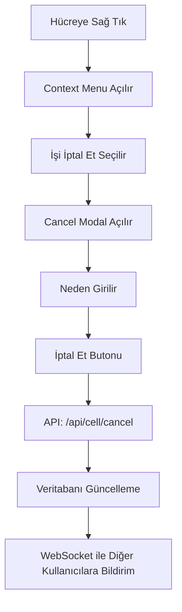
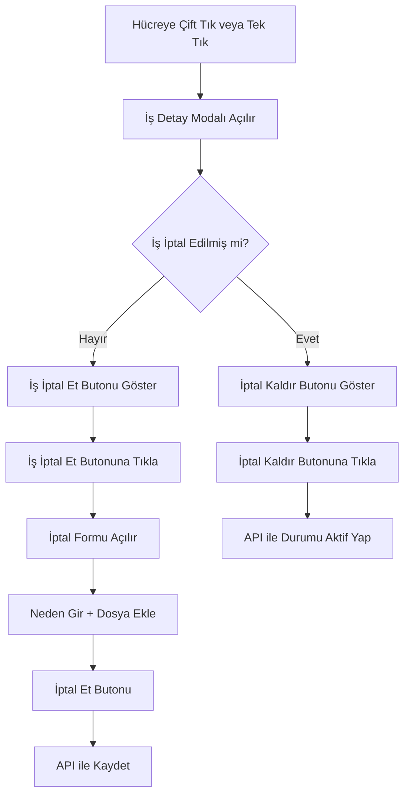

# İş İptal Sistemi - Detaylı Analiz ve Görev Planı

## 📋 Mevcut Durum Analizi

### 1. Mevcut İptal Mekanizması

#### 1.1 Akış


#### 1.2 Mevcut Dosya Yapısı

| Dosya | Açıklama |
|-------|----------|
| `templates/plan.html` | Plan sayfası şablonu |
| `static/js/realtime.js` | Frontend iptal işlemleri |
| `routes/realtime.py` | Backend API endpointleri |
| `models.py` | Veritabanı modelleri |

### 2. Mevcut Veritabanı Yapısı

#### 2.1 PlanCell Model (models.py:130-172)
```python
class PlanCell(db.Model):
    # ... diğer alanlar ...
    status = db.Column(db.String(20), nullable=False, default="active", index=True)  # active/cancelled
    cancelled_at = db.Column(db.DateTime, nullable=True)
    cancelled_by_user_id = db.Column(db.Integer, db.ForeignKey("user.id"), nullable=True, index=True)
    cancellation_reason = db.Column(db.Text, nullable=True)
```

#### 2.2 CellCancellation Model (models.py:547-560)
```python
class CellCancellation(db.Model):
    __tablename__ = "cell_cancellation"
    id = db.Column(db.Integer, primary_key=True)
    cell_id = db.Column(db.Integer, db.ForeignKey("plan_cell.id"), nullable=False, index=True)
    cancelled_by_user_id = db.Column(db.Integer, db.ForeignKey("user.id"), nullable=False, index=True)
    cancelled_at = db.Column(db.DateTime, nullable=False, default=datetime.now, index=True)
    reason = db.Column(db.Text, nullable=True)
    previous_status = db.Column(db.String(30), nullable=True)
```

### 3. Mevcut API Endpoints

#### 3.1 İptal Etme (routes/realtime.py:478-540)
```python
@realtime_bp.post("/api/cell/cancel")
def api_cell_cancel():
    # POST data: cell_id, reason
    # Returns: {ok, cell_id, status, cancelled_at}
```

#### 3.2 İptal Geri Alma (routes/realtime.py:543-592)
```python
@realtime_bp.post("/api/cell/restore")
def api_cell_restore():
    # POST data: cell_id
    # Returns: {ok, cell_id, status}
```

### 4. Frontend Context Menu (static/js/realtime.js:932-966)
```javascript
document.addEventListener('contextmenu', (e) => {
    const cell = e.target.closest('.cell');
    // ... context menu oluşturma ...
    if (isFilled) {
        items.push({ icon: '❌', label: 'İşi İptal Et', action: 'cancel', color: '#dc2626' });
    }
});
```

## 🎯 Yeni Tasarım

### 1. Hedeflenen Değişiklikler

#### 1.1 Yeni Akış


### 2. UI Değişiklikleri

#### 2.1 İş Detay Modalına Eklenecekler

```
┌─────────────────────────────────────────────────────────────┐
│ İş Detayı                                          [X] Kapat│
├─────────────────────────────────────────────────────────────┤
│ [Sil] [Kapat] [Kaydet]  [İş İptal Et]                      │
├─────────────────────────────────────────────────────────────┤
│ ... mevcut form alanları ...                                │
├─────────────────────────────────────────────────────────────┤
│ ════════════ İPTAL BİLGİSİ ═══════════════════════════════ │
│                                                              │
│  📅 İptal Tarihi: 02.02.2026 14:30                         │
│  👤 İptal Eden: Kullanıcı Adı                               │
│  📝 Neden: Müşteri talebi üzerine iptal edildi              │
│  📎 Dosya: iptal_dokumani.pdf                               │
│                                                              │
│  [İptal Kaldır]                                             │
│ ════════════════════════════════════════════════════════════│
└─────────────────────────────────────────────────────────────┘
```

#### 2.2 Tablo Hücresinde Görsel İptal Göstergesi

İptal edilen işler tabloda **hemen fark edilsin** diye şu görsel değişiklikler yapılacak:

```
┌─────────────────────────────────────────────────────────────────┐
│  Örnek Normal Hücre          │  Örnek İptal Edilmiş Hücre    │
├─────────────────────────────────────────────────────────────────┤
│  Gündüz                      │  ~~Gündüz~~                    │
│  Ali, Veli                   │  ~~Ali, Veli~~                 │
│  Test İşlemi                 │  ~~Test İşlemi~~               │
│                               │  (Kırmızı üstü çizili metin)   │
└─────────────────────────────────────────────────────────────────┘
```

**CSS Uygulaması:**
```css
/* İptal edilmiş hücreler için */
.cell.is-cancelled {
    background-color: #fef2f2 !important;  /* Açık kırmızı arka plan */
}

.cell.is-cancelled .cell-content,
.cell.is-cancelled .cell-text,
.cell.is-cancelled .person-name,
.cell.is-cancelled .shift-info,
.cell.is-cancelled .note-text {
    text-decoration: line-through;  /* Üstü çizili metin */
    color: #dc2626 !important;       /* Kırmızı renk */
    opacity: 0.7;                    /* Biraz soluk */
}

/* İptal icon'u ekle */
.cell.is-cancelled::before {
    content: '❌';
    position: absolute;
    top: 2px;
    right: 2px;
    font-size: 10px;
}
```

**Özellikler:**
- Tüm metinler ~~üzeri çizili~~ (strikethrough)
- Metin rengi kırmızı (#dc2626)
- Arka plan açık kırmızı (#fef2f2)
- İkon ile görsel vurgulama
- Hover'da daha belirgin hale getirilebilir

#### 2.2 İptal Formu (İptal Edilmemiş İşler İçin)

```
┌─────────────────────────────────────────────────────────────┐
│ İş Detayı                                          [X] Kapat│
├─────────────────────────────────────────────────────────────┤
│ [Sil] [Kapat] [Kaydet]  [İş İptal Et]                      │
├─────────────────────────────────────────────────────────────┤
│ ... mevcut form alanları ...                                │
├─────────────────────────────────────────────────────────────┤
│ ════════════ İŞ İPTAL FORMU ═══════════════════════════════ │
│                                                              │
│  📝 İptal Nedeni: * (zorunlu)                               │
│  ┌────────────────────────────────────────────────────────┐ │
│  │ İptal nedenini yazınız...                              │ │
│  └────────────────────────────────────────────────────────┘ │
│                                                              │
│  📎 Dosya Eki (Opsiyonel):                                  │
│  ┌────────────────────────────────────────────────────────┐ │
│  │ [Dosya Seç] veya sürükle bırak                        │ │
│  └────────────────────────────────────────────────────────┘ │
│                                                              │
│  [İptal Et]    [Vazgeç]                                     │
│ ════════════════════════════════════════════════════════════│
└─────────────────────────────────────────────────────────────┘
```

### 3. Veritabanı Değişiklikleri

#### 3.1 CellCancellation Modeline Eklenecekler
```python
class CellCancellation(db.Model):
    # ... mevcut alanlar ...
    
    # Yeni alanlar
    file_path = db.Column(db.String(400), nullable=True)  # İptal dokümanı
    file_name = db.Column(db.String(255), nullable=True)  # Orijinal dosya adı
    file_type = db.Column(db.String(30), nullable=True)   # Dosya tipi
```

## 📝 Görev Listesi

### Görev 1: Veritabanı Modeli Güncelleme
- [ ] CellCancellation modeline file_path, file_name, file_type alanları ekle
- [ ] Migration dosyası oluştur
- [ ] Veritabanını güncelle

### Görev 2: Backend API Güncelleme
- [ ] `/api/cell/cancel` endpointini dosya upload destekleyecek şekilde güncelle
- [ ] Dosya upload fonksiyonu ekle
- [ ] Dosya kaydetme path'ini belirle (instance/uploads/cancellations/)
- [ ] Dosya silme fonksiyonu ekle (geri alma durumunda)

### Görev 3: Frontend - İş Detay Modalı Güncelleme
- [ ] cellModal'a "İş İptal Et" butonu ekle
- [ ] İptal formu section'ı ekle (hidden olacak, butona basınca açılacak)
- [ ] İptal bilgisi section'ı ekle (iptal edilmiş işler için)
- [ ] Dosya upload alanı ekle (drag & drop destekli)
- [ ] "İptal Kaldır" butonu ekle

### Görev 4: Frontend - JavaScript Güncelleme
- [ ] İptal butonu click handler'ı yaz
- [ ] Dosya upload handler'ı yaz
- [ ] İptal API call'ı yaz (FormData kullanarak)
- [ ] İptal kaldır API call'ı yaz
- [ ] Modal'da iptal durumuna göre UI güncelleme

### Görev 5: Context Menu Temizleme
- [ ] Sağ tık menüsündeki "İşi İptal Et" seçeneğini kaldır
- [ ] veya "İptal Nedenini Göster" seçeneğini koru

### Görev 6: Test
- [ ] İptal işlemini test et
- [ ] Dosya upload'u test et
- [ ] İptal geri almayı test et
- [ ] Çakışma durumlarını test et
- [ ] Responsive görünümü test et

## 📁 Etkilenecek Dosyalar

| Dosya | Değişiklik Türü |
|-------|-----------------|
| `models.py` | Model güncelleme |
| `routes/realtime.py` | API endpoint güncelleme |
| `templates/plan.html` | Modal şablonu güncelleme |
| `static/js/realtime.js` | JavaScript güncelleme |
| `utils.py` | Dosya yardımcı fonksiyonları |
| Migration dosyası | Veritabanı güncelleme |

## 📅 Tahmini Süre

| Görev | Tahmini Süre |
|-------|-------------|
| Veritabanı Modeli | 30 dakika |
| Backend API | 1 saat |
| Frontend Modal | 2 saat |
| Frontend JS | 1.5 saat |
| Context Menu | 15 dakika |
| Test | 1 saat |
| **Toplam** | **~6 saat**

## ⚠️ Dikkat Edilmesi Gerekenler

1. **Dosya Güvenliği**: Upload edilen dosyaların tipini kontrol et
2. **Boyut Limiti**: Maksimum dosya boyutu belirle (ör: 10MB)
3. **Çakışma Kontrolü**: Aynı anda birden fazla kişi iptal ederse ne olacak?
4. **Geri Alma İzni**: Sadece iptal eden kişi veya admin mi geri alabilir?
5. **Arşivleme**: İptal edilen işlerin geçmişi korunmalı
