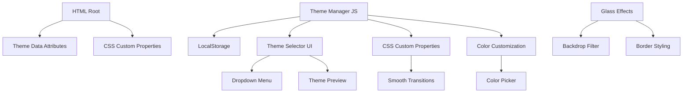
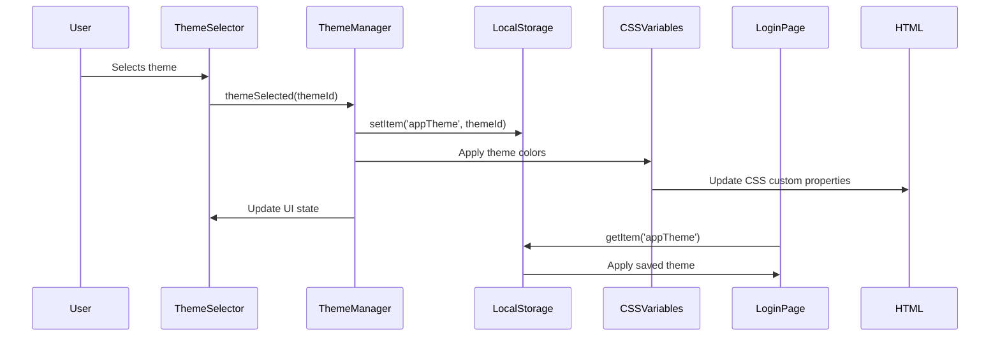

# Comprehensive Theme System - Technical Specification

## Table of Contents
1. [Overview](#overview)
2. [Current State Analysis](#current-state-analysis)
3. [Architecture](#architecture)
4. [Theme Definitions](#theme-definitions)
5. [CSS Variable System](#css-variable-system)
6. [JavaScript Theme Manager](#javascript-theme-manager)
7. [Theme Selector UI](#theme-selector-ui)
8. [Color Customization](#color-customization)
9. [Glass/Acrylic Effects](#glassacrylic-effects)
10. [LocalStorage Persistence](#localstorage-persistence)
11. [Login Page Support](#login-page-support)
12. [Implementation Plan](#implementation-plan)
13. [Migration Guide](#migration-guide)

---

## Overview

### Purpose
Add comprehensive multi-theme support to the existing application with 8 predefined themes, full color customization, glass effects, and persistent theme preferences.

### Scope
- CSS Theme System redesign
- JavaScript Theme Manager
- Theme Selector UI component
- Primary color customization
- Glass/Acrylic effects
- Login page theme support
- LocalStorage persistence

### Goals
1. Provide 8 predefined themes: Light, Dark, Pure Black, Pure White, Ocean, Forest, Sunset, Purple
2. Allow users to customize primary accent color
3. Implement smooth theme transitions
4. Support glass/acrylic effects
5. Persist theme preferences in LocalStorage
6. Ensure login page supports themes

---

## Current State Analysis

### Existing Implementation
- **CSS Variables**: Used in `style.css` (`:root` and `html.dark-mode`)
- **Dark Theme**: Separate `dark-theme.css` file with comprehensive overrides
- **Theme Toggle**: Class-based (`html.dark-mode`)
- **Storage**: `localStorage.getItem('darkMode')`
- **FOUC Prevention**: Inline script in `base.html`

### Current CSS Variables Structure
```css
:root {
  --bg: #f3f6fc;
  --card: rgba(255, 255, 255, 0.95);
  --text: #1e293b;
  --primary: #3b82f6;
  --success: #10b981;
  --warning: #f59e0b;
  --danger: #ef4444;
  /* ... more variables */
}

html.dark-mode {
  --bg: #0f172a;
  --card: #1e293b;
  --text: #f1f5f9;
  /* ... dark overrides */
}
```

### Issues to Address
1. No multi-theme support beyond light/dark
2. Hardcoded color values in some components
3. Theme switching requires page reload in some cases
4. No color customization option
5. Login page has separate styling

---

## Architecture

### System Components


### Theme Data Flow


---

## Theme Definitions

### Predefined Themes

| Theme ID | Name | Description | Use Case |
|----------|------|-------------|----------|
| `light` | Light | Clean white-based light theme | Default for business apps |
| `dark` | Dark | Slate-based dark theme | Reduced eye strain |
| `pure-black` | Pure Black | True black background | OLED screens, battery saving |
| `pure-white` | Pure White | Crisp white background | Print-friendly, high contrast |
| `ocean` | Ocean | Blue-teal ocean palette | Calming, professional |
| `forest` | Forest | Green earth tones | Nature-themed branding |
| `sunset` | Sunset | Warm orange-pink tones | Creative, energetic |
| `purple` | Purple | Deep purple accents | Modern, tech-focused |

### Theme Color Palettes

#### Light Theme (Default)
```css
--theme-name: "Light";
--theme-bg-primary: #f3f6fc;
--theme-bg-secondary: #ffffff;
--theme-bg-tertiary: #f8fafc;
--theme-text-primary: #1e293b;
--theme-text-secondary: #64748b;
--theme-accent-primary: #3b82f6;
--theme-accent-secondary: #6366f1;
--theme-border: #e2e8f0;
--theme-glass-bg: rgba(255, 255, 255, 0.85);
--theme-glass-border: rgba(255, 255, 255, 0.5);
```

#### Dark Theme
```css
--theme-name: "Dark";
--theme-bg-primary: #0f172a;
--theme-bg-secondary: #1e293b;
--theme-bg-tertiary: #334155;
--theme-text-primary: #f1f5f9;
--theme-text-secondary: #94a3b8;
--theme-accent-primary: #60a5fa;
--theme-accent-secondary: #818cf8;
--theme-border: #334155;
--theme-glass-bg: rgba(30, 41, 59, 0.85);
--theme-glass-border: rgba(255, 255, 255, 0.1);
```

#### Pure Black Theme
```css
--theme-name: "Pure Black";
--theme-bg-primary: #000000;
--theme-bg-secondary: #0a0a0a;
--theme-bg-tertiary: #171717;
--theme-text-primary: #ffffff;
--theme-text-secondary: #a3a3a3;
--theme-accent-primary: #3b82f6;
--theme-accent-secondary: #6366f1;
--theme-border: #262626;
--theme-glass-bg: rgba(0, 0, 0, 0.85);
--theme-glass-border: rgba(255, 255, 255, 0.08);
```

#### Pure White Theme
```css
--theme-name: "Pure White";
--theme-bg-primary: #ffffff;
--theme-bg-secondary: #ffffff;
--theme-bg-tertiary: #f5f5f5;
--theme-text-primary: #171717;
--theme-text-secondary: #525252;
--theme-accent-primary: #2563eb;
--theme-accent-secondary: #4f46e5;
--theme-border: #e5e5e5;
--theme-glass-bg: rgba(255, 255, 255, 0.95);
--theme-glass-border: rgba(0, 0, 0, 0.05);
```

#### Ocean Theme
```css
--theme-name: "Ocean";
--theme-bg-primary: #f0f9ff;
--theme-bg-secondary: #ffffff;
--theme-bg-tertiary: #e0f2fe;
--theme-text-primary: #0c4a6e;
--theme-text-secondary: #0369a1;
--theme-accent-primary: #0284c7;
--theme-accent-secondary: #0891b2;
--theme-border: #bae6fd;
--theme-glass-bg: rgba(255, 255, 255, 0.85);
--theme-glass-border: rgba(186, 230, 253, 0.5);
```

#### Forest Theme
```css
--theme-name: "Forest";
--theme-bg-primary: #f0fdf4;
--theme-bg-secondary: #ffffff;
--theme-bg-tertiary: #dcfce7;
--theme-text-primary: #14532d;
--theme-text-secondary: #166534;
--theme-accent-primary: #16a34a;
--theme-accent-secondary: #22c55e;
--theme-border: #bbf7d0;
--theme-glass-bg: rgba(255, 255, 255, 0.85);
--theme-glass-border: rgba(187, 247, 208, 0.5);
```

#### Sunset Theme
```css
--theme-name: "Sunset";
--theme-bg-primary: #fff7ed;
--theme-bg-secondary: #ffffff;
--theme-bg-tertiary: #ffedd5;
--theme-text-primary: #7c2d12;
--theme-text-secondary: #c2410c;
--theme-accent-primary: #ea580c;
--theme-accent-secondary: #f97316;
--theme-border: #fed7aa;
--theme-glass-bg: rgba(255, 255, 255, 0.85);
--theme-glass-border: rgba(254, 215, 170, 0.5);
```

#### Purple Theme
```css
--theme-name: "Purple";
--theme-bg-primary: #faf5ff;
--theme-bg-secondary: #ffffff;
--theme-bg-tertiary: #f3e8ff;
--theme-text-primary: #581c87;
--theme-text-secondary: #7e22ce;
--theme-accent-primary: #9333ea;
--theme-accent-secondary: #a855f7;
--theme-border: #e9d5ff;
--theme-glass-bg: rgba(255, 255, 255, 0.85);
--theme-glass-border: rgba(233, 213, 255, 0.5);
```

---

## CSS Variable System

### New CSS Variable Hierarchy

```css
:root {
  /* ============================================
     THEME TOKENS - Base Level
     ============================================ */
  --theme-id: "light";
  --theme-name: "Light";
  
  /* ============================================
     SEMANTIC COLOR VARIABLES
     ============================================ */
  
  /* Background Colors - 5 levels */
  --bg-primary: var(--theme-bg-primary, #f3f6fc);
  --bg-secondary: var(--theme-bg-secondary, #ffffff);
  --bg-tertiary: var(--theme-bg-tertiary, #f8fafc);
  --bg-elevated: var(--theme-bg-tertiary, #f8fafc);
  --bg-overlay: rgba(0, 0, 0, 0.5);
  
  /* Text Colors - 4 levels */
  --text-primary: var(--theme-text-primary, #1e293b);
  --text-secondary: var(--theme-text-secondary, #64748b);
  --text-tertiary: var(--theme-text-tertiary, #94a3b8);
  --text-inverted: #ffffff;
  
  /* Accent Colors */
  --accent-primary: var(--theme-accent-primary, #3b82f6);
  --accent-primary-hover: color-mix(in srgb, var(--accent-primary), black 10%);
  --accent-primary-active: color-mix(in srgb, var(--accent-primary), black 20%);
  --accent-secondary: var(--theme-accent-secondary, #6366f1);
  
  /* Border Colors - 3 levels */
  --border-light: var(--theme-border-light, #f1f5f9);
  --border-default: var(--theme-border, #e2e8f0);
  --border-dark: var(--theme-border-dark, #cbd5e1);
  
  /* Status Colors - Consistent across themes */
  --status-success: #10b981;
  --status-success-bg: #ecfdf5;
  --status-success-text: #065f46;
  
  --status-warning: #f59e0b;
  --status-warning-bg: #fffbeb;
  --status-warning-text: #92400e;
  
  --status-danger: #ef4444;
  --status-danger-bg: #fef2f2;
  --status-danger-text: #b91c1c;
  
  --status-info: #3b82f6;
  --status-info-bg: #eff6ff;
  --status-info-text: #1e40af;
  
  --status-online: #22c55e;
  --status-offline: #94a3b8;
  
  /* ============================================
     COMPONENT VARIABLES
     ============================================ */
  
  /* Cards */
  --card-bg: var(--bg-secondary);
  --card-border: var(--border-default);
  --card-shadow: 0 4px 6px -1px rgba(0, 0, 0, 0.1);
  
  /* Glass/Acrylic Effects */
  --glass-bg: var(--theme-glass-bg, rgba(255, 255, 255, 0.85));
  --glass-border: var(--theme-glass-border, rgba(255, 255, 255, 0.5));
  --glass-blur: 16px;
  --glass-opacity: 0.85;
  
  /* Buttons */
  --btn-primary-bg: var(--accent-primary);
  --btn-primary-text: #ffffff;
  --btn-primary-hover: var(--accent-primary-hover);
  --btn-secondary-bg: var(--bg-tertiary);
  --btn-secondary-text: var(--text-primary);
  --btn-secondary-border: var(--border-default);
  
  /* Inputs */
  --input-bg: var(--bg-secondary);
  --input-border: var(--border-default);
  --input-text: var(--text-primary);
  --input-placeholder: var(--text-tertiary);
  --input-focus-border: var(--accent-primary);
  --input-focus-shadow: rgba(59, 130, 246, 0.25);
  
  /* Tables */
  --table-header-bg: var(--bg-tertiary);
  --table-header-text: var(--text-primary);
  --table-row-bg: var(--bg-secondary);
  --table-row-alt: var(--bg-tertiary);
  --table-row-hover: var(--bg-tertiary);
  --table-cell-border: var(--border-light);
  
  /* ============================================
     CUSTOMIZABLE ACCENT COLOR
     ============================================ */
  --custom-primary: var(--custom-primary-color, #3b82f6);
  --custom-primary-hover: color-mix(in srgb, var(--custom-primary), black 10%);
  --custom-primary-active: color-mix(in srgb, var(--custom-primary), black 20%);
  
  /* ============================================
     ANIMATION & TRANSITIONS
     ============================================ */
  --transition-fast: 150ms ease;
  --transition-normal: 300ms ease;
  --transition-slow: 500ms ease;
}

/* ============================================
   THEME DATA ATTRIBUTES
   ============================================ */

html[data-theme="light"] {
  --theme-bg-primary: #f3f6fc;
  --theme-bg-secondary: #ffffff;
  --theme-bg-tertiary: #f8fafc;
  --theme-text-primary: #1e293b;
  --theme-text-secondary: #64748b;
  --theme-accent-primary: #3b82f6;
  --theme-accent-secondary: #6366f1;
  --theme-border: #e2e8f0;
  --theme-border-light: #f1f5f9;
  --theme-border-dark: #cbd5e1;
  --theme-glass-bg: rgba(255, 255, 255, 0.85);
  --theme-glass-border: rgba(255, 255, 255, 0.5);
}

html[data-theme="dark"] {
  --theme-bg-primary: #0f172a;
  --theme-bg-secondary: #1e293b;
  --theme-bg-tertiary: #334155;
  --theme-text-primary: #f1f5f9;
  --theme-text-secondary: #94a3b8;
  --theme-accent-primary: #60a5fa;
  --theme-accent-secondary: #818cf8;
  --theme-border: #334155;
  --theme-border-light: #475569;
  --theme-border-dark: #1e293b;
  --theme-glass-bg: rgba(30, 41, 59, 0.85);
  --theme-glass-border: rgba(255, 255, 255, 0.1);
}

html[data-theme="pure-black"] {
  --theme-bg-primary: #000000;
  --theme-bg-secondary: #0a0a0a;
  --theme-bg-tertiary: #171717;
  --theme-text-primary: #ffffff;
  --theme-text-secondary: #a3a3a3;
  --theme-accent-primary: #3b82f6;
  --theme-accent-secondary: #6366f1;
  --theme-border: #262626;
  --theme-border-light: #262626;
  --theme-border-dark: #000000;
  --theme-glass-bg: rgba(0, 0, 0, 0.9);
  --theme-glass-border: rgba(255, 255, 255, 0.08);
}

html[data-theme="pure-white"] {
  --theme-bg-primary: #ffffff;
  --theme-bg-secondary: #ffffff;
  --theme-bg-tertiary: #f5f5f5;
  --theme-text-primary: #171717;
  --theme-text-secondary: #525252;
  --theme-accent-primary: #2563eb;
  --theme-accent-secondary: #4f46e5;
  --theme-border: #e5e5e5;
  --theme-border-light: #f5f5f5;
  --theme-border-dark: #d4d4d4;
  --theme-glass-bg: rgba(255, 255, 255, 0.95);
  --theme-glass-border: rgba(0, 0, 0, 0.05);
}

html[data-theme="ocean"] {
  --theme-bg-primary: #f0f9ff;
  --theme-bg-secondary: #ffffff;
  --theme-bg-tertiary: #e0f2fe;
  --theme-text-primary: #0c4a6e;
  --theme-text-secondary: #0369a1;
  --theme-accent-primary: #0284c7;
  --theme-accent-secondary: #0891b2;
  --theme-border: #bae6fd;
  --theme-border-light: #e0f2fe;
  --theme-border-dark: #7dd3fc;
  --theme-glass-bg: rgba(255, 255, 255, 0.85);
  --theme-glass-border: rgba(186, 230, 253, 0.5);
}

html[data-theme="forest"] {
  --theme-bg-primary: #f0fdf4;
  --theme-bg-secondary: #ffffff;
  --theme-bg-tertiary: #dcfce7;
  --theme-text-primary: #14532d;
  --theme-text-secondary: #166534;
  --theme-accent-primary: #16a34a;
  --theme-accent-secondary: #22c55e;
  --theme-border: #bbf7d0;
  --theme-border-light: #dcfce7;
  --theme-border-dark: #86efac;
  --theme-glass-bg: rgba(255, 255, 255, 0.85);
  --theme-glass-border: rgba(187, 247, 208, 0.5);
}

html[data-theme="sunset"] {
  --theme-bg-primary: #fff7ed;
  --theme-bg-secondary: #ffffff;
  --theme-bg-tertiary: #ffedd5;
  --theme-text-primary: #7c2d12;
  --theme-text-secondary: #c2410c;
  --theme-accent-primary: #ea580c;
  --theme-accent-secondary: #f97316;
  --theme-border: #fed7aa;
  --theme-border-light: #ffedd5;
  --theme-border-dark: #fdba74;
  --theme-glass-bg: rgba(255, 255, 255, 0.85);
  --theme-glass-border: rgba(254, 215, 170, 0.5);
}

html[data-theme="purple"] {
  --theme-bg-primary: #faf5ff;
  --theme-bg-secondary: #ffffff;
  --theme-bg-tertiary: #f3e8ff;
  --theme-text-primary: #581c87;
  --theme-text-secondary: #7e22ce;
  --theme-accent-primary: #9333ea;
  --theme-accent-secondary: #a855f7;
  --theme-border: #e9d5ff;
  --theme-border-light: #f3e8ff;
  --theme-border-dark: #d8b4fe;
  --theme-glass-bg: rgba(255, 255, 255, 0.85);
  --theme-glass-border: rgba(233, 213, 255, 0.5);
}

/* ============================================
   THEME TRANSITIONS
   ============================================ */

html[data-theme] {
  transition: background-color 0.3s ease, color 0.3s ease, border-color 0.3s ease;
}

/* Smooth theme transition */
html {
  --theme-transition: background-color 0.3s ease, color 0.3s ease, border-color 0.3s ease, box-shadow 0.3s ease;
  transition: var(--theme-transition);
}

/* Disable transitions for reduced motion preference */
@media (prefers-reduced-motion: reduce) {
  html {
    transition: none;
  }
}
```

---

## JavaScript Theme Manager

### File Structure
```
static/js/
└── theme/
    ├── theme-manager.js    # Main theme manager class
    ├── theme-data.js        # Theme definitions
    ├── theme-storage.js     # LocalStorage handling
    ├── theme-transition.js  # Smooth transitions
    └── index.js            # Module exports
```

### Theme Data (`theme-data.js`)
```javascript
// static/js/theme/theme-data.js

export const THEMES = {
  light: {
    id: 'light',
    name: 'Light',
    description: 'Clean and professional light theme',
    icon: 'sun',
    colors: {
      bgPrimary: '#f3f6fc',
      bgSecondary: '#ffffff',
      bgTertiary: '#f8fafc',
      textPrimary: '#1e293b',
      textSecondary: '#64748b',
      accentPrimary: '#3b82f6',
      accentSecondary: '#6366f1',
      border: '#e2e8f0',
      glassBg: 'rgba(255, 255, 255, 0.85)',
      glassBorder: 'rgba(255, 255, 255, 0.5)'
    }
  },
  
  dark: {
    id: 'dark',
    name: 'Dark',
    description: 'Easy on the eyes dark theme',
    icon: 'moon',
    colors: {
      bgPrimary: '#0f172a',
      bgSecondary: '#1e293b',
      bgTertiary: '#334155',
      textPrimary: '#f1f5f9',
      textSecondary: '#94a3b8',
      accentPrimary: '#60a5fa',
      accentSecondary: '#818cf8',
      border: '#334155',
      glassBg: 'rgba(30, 41, 59, 0.85)',
      glassBorder: 'rgba(255, 255, 255, 0.1)'
    }
  },
  
  'pure-black': {
    id: 'pure-black',
    name: 'Pure Black',
    description: 'True black for OLED screens',
    icon: 'moon',
    colors: {
      bgPrimary: '#000000',
      bgSecondary: '#0a0a0a',
      bgTertiary: '#171717',
      textPrimary: '#ffffff',
      textSecondary: '#a3a3a3',
      accentPrimary: '#3b82f6',
      accentSecondary: '#6366f1',
      border: '#262626',
      glassBg: 'rgba(0, 0, 0, 0.9)',
      glassBorder: 'rgba(255, 255, 255, 0.08)'
    }
  },
  
  'pure-white': {
    id: 'pure-white',
    name: 'Pure White',
    description: 'Crisp white for high contrast',
    icon: 'sun',
    colors: {
      bgPrimary: '#ffffff',
      bgSecondary: '#ffffff',
      bgTertiary: '#f5f5f5',
      textPrimary: '#171717',
      textSecondary: '#525252',
      accentPrimary: '#2563eb',
      accentSecondary: '#4f46e5',
      border: '#e5e5e5',
      glassBg: 'rgba(255, 255, 255, 0.95)',
      glassBorder: 'rgba(0, 0, 0, 0.05)'
    }
  },
  
  ocean: {
    id: 'ocean',
    name: 'Ocean',
    description: 'Calming blue ocean palette',
    icon: 'droplet',
    colors: {
      bgPrimary: '#f0f9ff',
      bgSecondary: '#ffffff',
      bgTertiary: '#e0f2fe',
      textPrimary: '#0c4a6e',
      textSecondary: '#0369a1',
      accentPrimary: '#0284c7',
      accentSecondary: '#0891b2',
      border: '#bae6fd',
      glassBg: 'rgba(255, 255, 255, 0.85)',
      glassBorder: 'rgba(186, 230, 253, 0.5)'
    }
  },
  
  forest: {
    id: 'forest',
    name: 'Forest',
    description: 'Natural green earth tones',
    icon: 'tree',
    colors: {
      bgPrimary: '#f0fdf4',
      bgSecondary: '#ffffff',
      bgTertiary: '#dcfce7',
      textPrimary: '#14532d',
      textSecondary: '#166534',
      accentPrimary: '#16a34a',
      accentSecondary: '#22c55e',
      border: '#bbf7d0',
      glassBg: 'rgba(255, 255, 255, 0.85)',
      glassBorder: 'rgba(187, 247, 208, 0.5)'
    }
  },
  
  sunset: {
    id: 'sunset',
    name: 'Sunset',
    description: 'Warm orange-pink tones',
    icon: 'sunset',
    colors: {
      bgPrimary: '#fff7ed',
      bgSecondary: '#ffffff',
      bgTertiary: '#ffedd5',
      textPrimary: '#7c2d12',
      textSecondary: '#c2410c',
      accentPrimary: '#ea580c',
      accentSecondary: '#f97316',
      border: '#fed7aa',
      glassBg: 'rgba(255, 255, 255, 0.85)',
      glassBorder: 'rgba(254, 215, 170, 0.5)'
    }
  },
  
  purple: {
    id: 'purple',
    name: 'Purple',
    description: 'Modern purple accents',
    icon: 'sparkles',
    colors: {
      bgPrimary: '#faf5ff',
      bgSecondary: '#ffffff',
      bgTertiary: '#f3e8ff',
      textPrimary: '#581c87',
      textSecondary: '#7e22ce',
      accentPrimary: '#9333ea',
      accentSecondary: '#a855f7',
      border: '#e9d5ff',
      glassBg: 'rgba(255, 255, 255, 0.85)',
      glassBorder: 'rgba(233, 213, 255, 0.5)'
    }
  }
};

export const DEFAULT_THEME = 'light';
export const STORAGE_KEY = 'appTheme';
export const CUSTOM_COLOR_KEY = 'appCustomPrimary';
```

### Theme Storage (`theme-storage.js`)
```javascript
// static/js/theme/theme-storage.js

import { STORAGE_KEY, CUSTOM_COLOR_KEY } from './theme-data.js';

export class ThemeStorage {
  static getTheme() {
    try {
      return localStorage.getItem(STORAGE_KEY) || null;
    } catch (e) {
      console.warn('ThemeStorage: Unable to read theme from localStorage', e);
      return null;
    }
  }
  
  static setTheme(themeId) {
    try {
      localStorage.setItem(STORAGE_KEY, themeId);
      return true;
    } catch (e) {
      console.warn('ThemeStorage: Unable to save theme to localStorage', e);
      return false;
    }
  }
  
  static getCustomPrimaryColor() {
    try {
      return localStorage.getItem(CUSTOM_COLOR_KEY) || null;
    } catch (e) {
      return null;
    }
  }
  
  static setCustomPrimaryColor(color) {
    try {
      localStorage.setItem(CUSTOM_COLOR_KEY, color);
      return true;
    } catch (e) {
      return false;
    }
  }
  
  static clearTheme() {
    try {
      localStorage.removeItem(STORAGE_KEY);
      localStorage.removeItem(CUSTOM_COLOR_KEY);
      return true;
    } catch (e) {
      return false;
    }
  }
  
  static exportSettings() {
    return {
      theme: this.getTheme(),
      customPrimaryColor: this.getCustomPrimaryColor()
    };
  }
  
  static importSettings(settings) {
    if (settings.theme) {
      this.setTheme(settings.theme);
    }
    if (settings.customPrimaryColor) {
      this.setCustomPrimaryColor(settings.customPrimaryColor);
    }
  }
}
```

### Theme Transition Manager (`theme-transition.js`)
```javascript
// static/js/theme/theme-transition.js

export class ThemeTransition {
  constructor() {
    this.isTransitioning = false;
    this.transitionDuration = 300; // ms
  }
  
  prepareTransition(element = document.documentElement) {
    element.style.transition = 'none';
    element.classList.add('theme-transitioning');
  }
  
  async applyTransition(element = document.documentElement) {
    return new Promise((resolve) => {
      // Force reflow
      void element.offsetWidth;
      
      // Enable transitions
      element.style.transition = '';
      element.classList.remove('theme-transitioning');
      
      // Wait for transition to complete
      setTimeout(resolve, this.transitionDuration);
    });
  }
  
  disableTransitions(element = document.documentElement) {
    element.classList.add('theme-transition-disabled');
  }
  
  enableTransitions(element = document.documentElement) {
    element.classList.remove('theme-transition-disabled');
  }
}
```

### Main Theme Manager (`theme-manager.js`)
```javascript
// static/js/theme/theme-manager.js

import { THEMES, DEFAULT_THEME, STORAGE_KEY, CUSTOM_COLOR_KEY } from './theme-data.js';
import { ThemeStorage } from './theme-storage.js';
import { ThemeTransition } from './theme-transition.js';

export class ThemeManager {
  constructor() {
    this.currentTheme = null;
    this.customPrimaryColor = null;
    this.transitionManager = new ThemeTransition();
    this.listeners = new Set();
    
    this._init();
  }
  
  _init() {
    // Apply saved theme on initialization
    const savedTheme = ThemeStorage.getTheme();
    this.currentTheme = savedTheme || DEFAULT_THEME;
    
    // Apply custom primary color
    this.customPrimaryColor = ThemeStorage.getCustomPrimaryColor();
    
    // Apply to DOM
    this._applyTheme(this.currentTheme);
    this._applyCustomPrimaryColor();
    
    // Listen for system theme changes (if using system preference)
    this._setupSystemThemeListener();
  }
  
  _setupSystemThemeListener() {
    if (window.matchMedia) {
      const mediaQuery = window.matchMedia('(prefers-color-scheme: dark)');
      mediaQuery.addEventListener('change', (e) => {
        // Only auto-switch if user hasn't set a preference
        if (!ThemeStorage.getTheme()) {
          this.setTheme(e.matches ? 'dark' : 'light');
        }
      });
    }
  }
  
  _applyTheme(themeId) {
    const theme = THEMES[themeId];
    if (!theme) {
      console.warn(`ThemeManager: Unknown theme "${themeId}", falling back to "${DEFAULT_THEME}"`);
      themeId = DEFAULT_THEME;
      theme = THEMES[themeId];
    }
    
    const root = document.documentElement;
    
    // Prepare for smooth transition
    this.transitionManager.prepareTransition(root);
    
    // Apply theme data attribute
    root.setAttribute('data-theme', themeId);
    
    // Apply CSS custom properties
    this._applyThemeColors(theme);
    
    // Apply transition
    this.transitionManager.applyTransition(root);
    
    // Update logo filter for dark themes
    this._updateLogoForTheme(themeId);
    
    this.currentTheme = themeId;
    
    // Notify listeners
    this._notifyListeners('themeChanged', { themeId, theme });
  }
  
  _applyThemeColors(theme) {
    const root = document.documentElement;
    const { colors } = theme;
    
    // Apply all theme colors as CSS custom properties
    for (const [key, value] of Object.entries(colors)) {
      const propName = `--theme-${key.replace(/([A-Z])/g, '-$1').toLowerCase()}`;
      root.style.setProperty(propName, value);
    }
  }
  
  _applyCustomPrimaryColor() {
    if (!this.customPrimaryColor) return;
    
    const root = document.documentElement;
    root.style.setProperty('--custom-primary-color', this.customPrimaryColor);
    root.style.setProperty('--custom-primary', this.customPrimaryColor);
    
    // Generate hover and active colors
    const hoverColor = this._lightenDarkenColor(this.customPrimaryColor, 10);
    const activeColor = this._lightenDarkenColor(this.customPrimaryColor, 20);
    
    root.style.setProperty('--custom-primary-hover', hoverColor);
    root.style.setProperty('--custom-primary-active', activeColor);
  }
  
  _lightenDarkenColor(color, percent) {
    const num = parseInt(color.replace('#', ''), 16);
    const amt = Math.round(2.55 * percent);
    const R = Math.min(255, (num >> 16) + amt);
    const G = Math.min(255, ((num >> 8) & 0x00FF) + amt);
    const B = Math.min(255, (num & 0x0000FF) + amt);
    return `#${(0x1000000 + R * 0x10000 + G * 0x100 + B).toString(16).slice(1)}`;
  }
  
  _updateLogoForTheme(themeId) {
    const darkThemes = ['dark', 'pure-black'];
    const logo = document.querySelector('.brandLogo');
    
    if (logo) {
      if (darkThemes.includes(themeId)) {
        logo.classList.add('theme-dark-logo');
      } else {
        logo.classList.remove('theme-dark-logo');
      }
    }
  }
  
  _notifyListeners(event, data) {
    this.listeners.forEach(callback => {
      try {
        callback(event, data);
      } catch (e) {
        console.warn('ThemeManager: Listener error', e);
      }
    });
  }
  
  // Public API
  
  setTheme(themeId) {
    if (!THEMES[themeId]) {
      console.warn(`ThemeManager: Invalid theme "${themeId}"`);
      return false;
    }
    
    ThemeStorage.setTheme(themeId);
    this._applyTheme(themeId);
    
    return true;
  }
  
  getTheme() {
    return this.currentTheme;
  }
  
  getThemeData() {
    return THEMES[this.currentTheme];
  }
  
  getAllThemes() {
    return THEMES;
  }
  
  setCustomPrimaryColor(color) {
    // Validate color format
    if (!/^#[0-9A-Fa-f]{6}$/.test(color)) {
      console.warn('ThemeManager: Invalid color format');
      return false;
    }
    
    this.customPrimaryColor = color;
    ThemeStorage.setCustomPrimaryColor(color);
    this._applyCustomPrimaryColor();
    
    this._notifyListeners('customColorChanged', { color });
    
    return true;
  }
  
  getCustomPrimaryColor() {
    return this.customPrimaryColor;
  }
  
  resetToDefaults() {
    ThemeStorage.clearTheme();
    this.currentTheme = DEFAULT_THEME;
    this.customPrimaryColor = null;
    this._applyTheme(DEFAULT_THEME);
    
    // Remove custom color properties
    const root = document.documentElement;
    root.style.removeProperty('--custom-primary-color');
    root.style.removeProperty('--custom-primary');
    root.style.removeProperty('--custom-primary-hover');
    root.style.removeProperty('--custom-primary-active');
    
    this._notifyListeners('themeReset', {});
  }
  
  addListener(callback) {
    this.listeners.add(callback);
    return () => this.listeners.delete(callback);
  }
  
  // Compatibility method for existing code
  toggleDarkMode() {
    const newTheme = this.currentTheme === 'dark' ? 'light' : 'dark';
    return this.setTheme(newTheme);
  }
  
  isDarkMode() {
    return this.currentTheme === 'dark';
  }
}

// Singleton instance
let themeManagerInstance = null;

export function getThemeManager() {
  if (!themeManagerInstance) {
    themeManagerInstance = new ThemeManager();
  }
  return themeManagerInstance;
}
```

### Module Index (`index.js`)
```javascript
// static/js/theme/index.js

export { ThemeManager, getThemeManager } from './theme-manager.js';
export { ThemeStorage } from './theme-storage.js';
export { ThemeTransition } from './theme-transition.js';
export { THEMES, DEFAULT_THEME } from './theme-data.js';
```

---

## Theme Selector UI

### Theme Selector Component Structure

```html
<!-- Theme Selector Dropdown -->
<div class="theme-selector" id="themeSelector">
  <button class="theme-selector-trigger" type="button" aria-label="Select theme">
    <span class="theme-current-icon">
      <!-- Icon injected by JS -->
    </span>
    <span class="theme-current-name">Light</span>
    <svg class="theme-dropdown-arrow" width="12" height="12" viewBox="0 0 24 24">
      <path d="M7 10l5 5 5-5z" fill="currentColor"/>
    </svg>
  </button>
  
  <div class="theme-dropdown-menu" hidden>
    <!-- Theme Items -->
    <div class="theme-item" data-theme="light" role="button" tabindex="0">
      <div class="theme-preview">
        <div class="theme-preview-bar" style="background: #f3f6fc"></div>
        <div class="theme-preview-bar" style="background: #ffffff"></div>
        <div class="theme-preview-dot" style="background: #3b82f6"></div>
      </div>
      <span class="theme-name">Light</span>
      <svg class="theme-check" width="16" height="16" viewBox="0 0 24 24">
        <path d="M9 16.17L4.83 12l-1.42 1.41L9 19 21 7l-1.41-1.41z" fill="currentColor"/>
      </svg>
    </div>
    
    <div class="theme-item" data-theme="dark" role="button" tabindex="0">
      <div class="theme-preview">
        <div class="theme-preview-bar" style="background: #0f172a"></div>
        <div class="theme-preview-bar" style="background: #1e293b"></div>
        <div class="theme-preview-dot" style="background: #60a5fa"></div>
      </div>
      <span class="theme-name">Dark</span>
      <svg class="theme-check" width="16" height="16" viewBox="0 0 24 24">
        <path d="M9 16.17L4.83 12l-1.42 1.41L9 19 21 7l-1.41-1.41z" fill="currentColor"/>
      </svg>
    </div>
    
    <!-- Divider -->
    <div class="theme-divider"></div>
    
    <!-- Color Customization Section -->
    <div class="theme-custom-section">
      <div class="theme-custom-header">
        <span>Custom Accent Color</span>
      </div>
      <div class="theme-custom-color-picker">
        <input type="color" id="customPrimaryColorPicker" value="#3b82f6">
        <input type="text" id="customPrimaryColorText" value="#3b82f6" maxlength="7">
      </div>
    </div>
  </div>
</div>
```

### Theme Selector CSS
```css
/* static/css/theme-selector.css */

/* ============================================
   THEME SELECTOR COMPONENT
   ============================================ */

.theme-selector {
  position: relative;
  display: inline-block;
}

.theme-selector-trigger {
  display: flex;
  align-items: center;
  gap: 8px;
  padding: 8px 12px;
  background: var(--bg-tertiary);
  border: 1px solid var(--border);
  border-radius: var(--radius-sm);
  cursor: pointer;
  font-size: 13px;
  font-weight: 500;
  color: var(--text-primary);
  transition: all 0.2s ease;
}

.theme-selector-trigger:hover {
  background: var(--bg-secondary);
  border-color: var(--accent-primary);
}

.theme-current-icon {
  display: flex;
  align-items: center;
  justify-content: center;
  width: 18px;
  height: 18px;
}

.theme-current-name {
  white-space: nowrap;
}

.theme-dropdown-arrow {
  margin-left: 4px;
  opacity: 0.6;
  transition: transform 0.2s ease;
}

.theme-selector.open .theme-dropdown-arrow {
  transform: rotate(180deg);
}

/* Dropdown Menu */
.theme-dropdown-menu {
  position: absolute;
  top: calc(100% + 8px);
  right: 0;
  min-width: 280px;
  background: var(--bg-secondary);
  border: 1px solid var(--border);
  border-radius: var(--radius);
  box-shadow: var(--shadow-lg);
  padding: 8px;
  z-index: 10000;
  animation: themeDropdownFadeIn 0.2s ease;
}

@keyframes themeDropdownFadeIn {
  from {
    opacity: 0;
    transform: translateY(-8px);
  }
  to {
    opacity: 1;
    transform: translateY(0);
  }
}

/* Theme Item */
.theme-item {
  display: flex;
  align-items: center;
  gap: 12px;
  padding: 10px 12px;
  border-radius: var(--radius-sm);
  cursor: pointer;
  transition: background 0.15s ease;
}

.theme-item:hover {
  background: var(--bg-tertiary);
}

.theme-item.active {
  background: var(--bg-tertiary);
}

.theme-item.active .theme-check {
  opacity: 1;
}

.theme-preview {
  display: flex;
  align-items: center;
  gap: 2px;
  flex-shrink: 0;
}

.theme-preview-bar {
  width: 24px;
  height: 16px;
  border-radius: 3px;
  border: 1px solid var(--border);
}

.theme-preview-dot {
  width: 16px;
  height: 16px;
  border-radius: 50%;
  margin-left: 4px;
}

.theme-name {
  flex: 1;
  font-size: 14px;
  font-weight: 500;
  color: var(--text-primary);
}

.theme-check {
  opacity: 0;
  color: var(--accent-primary);
  transition: opacity 0.15s ease;
}

/* Divider */
.theme-divider {
  height: 1px;
  background: var(--border);
  margin: 8px 0;
}

/* Custom Color Section */
.theme-custom-section {
  padding: 8px 12px;
}

.theme-custom-header {
  font-size: 12px;
  font-weight: 600;
  color: var(--text-secondary);
  margin-bottom: 8px;
  text-transform: uppercase;
  letter-spacing: 0.5px;
}

.theme-custom-color-picker {
  display: flex;
  align-items: center;
  gap: 8px;
}

.theme-custom-color-picker input[type="color"] {
  width: 36px;
  height: 36px;
  padding: 0;
  border: 2px solid var(--border);
  border-radius: var(--radius-sm);
  cursor: pointer;
  background: none;
}

.theme-custom-color-picker input[type="color"]::-webkit-color-swatch-wrapper {
  padding: 2px;
}

.theme-custom-color-picker input[type="color"]::-webkit-color-swatch {
  border: none;
  border-radius: 4px;
}

.theme-custom-color-picker input[type="text"] {
  flex: 1;
  padding: 8px 12px;
  border: 1px solid var(--border);
  border-radius: var(--radius-sm);
  font-size: 13px;
  font-family: monospace;
  color: var(--text-primary);
  background: var(--bg-tertiary);
}

.theme-custom-color-picker input[type="text"]:focus {
  outline: none;
  border-color: var(--accent-primary);
}

/* Keyboard Navigation */
.theme-item:focus {
  outline: none;
}

.theme-item:focus-visible {
  box-shadow: 0 0 0 2px var(--accent-primary);
}
```

### Theme Selector JavaScript
```javascript
// static/js/theme/theme-selector.js

import { getThemeManager, THEMES } from './theme-manager.js';

export class ThemeSelector {
  constructor(container) {
    this.container = container;
    this.themeManager = getThemeManager();
    this.isOpen = false;
    
    this._init();
  }
  
  _init() {
    this._renderTrigger();
    this._renderDropdown();
    this._bindEvents();
    this._syncWithThemeManager();
  }
  
  _renderTrigger() {
    const currentTheme = this.themeManager.getThemeData();
    this.container.innerHTML = `
      <button class="theme-selector-trigger" type="button" aria-label="Select theme" aria-expanded="false">
        <span class="theme-current-icon">
          ${this._getThemeIcon(currentTheme.id)}
        </span>
        <span class="theme-current-name">${currentTheme.name}</span>
        <svg class="theme-dropdown-arrow" width="12" height="12" viewBox="0 0 24 24">
          <path d="M7 10l5 5 5-5z" fill="currentColor"/>
        </svg>
      </button>
    `;
  }
  
  _renderDropdown() {
    const dropdown = document.createElement('div');
    dropdown.className = 'theme-dropdown-menu';
    dropdown.hidden = true;
    
    let itemsHtml = '';
    for (const [themeId, theme] of Object.entries(THEMES)) {
      itemsHtml += `
        <div class="theme-item ${themeId === this.themeManager.getTheme() ? 'active' : ''}" 
             data-theme="${themeId}" 
             role="button" 
             tabindex="0"
             aria-label="${theme.name} - ${theme.description}">
          <div class="theme-preview">
            <div class="theme-preview-bar" style="background: ${theme.colors.bgPrimary}"></div>
            <div class="theme-preview-bar" style="background: ${theme.colors.bgSecondary}"></div>
            <div class="theme-preview-dot" style="background: ${theme.colors.accentPrimary}"></div>
          </div>
          <span class="theme-name">${theme.name}</span>
          <svg class="theme-check" width="16" height="16" viewBox="0 0 24 24">
            <path d="M9 16.17L4.83 12l-1.42 1.41L9 19 21 7l-1.41-1.41z" fill="currentColor"/>
          </svg>
        </div>
      `;
    }
    
    const customColor = this.themeManager.getCustomPrimaryColor() || '#3b82f6';
    
    dropdown.innerHTML = `
      ${itemsHtml}
      <div class="theme-divider"></div>
      <div class="theme-custom-section">
        <div class="theme-custom-header">
          <span>Custom Accent Color</span>
        </div>
        <div class="theme-custom-color-picker">
          <input type="color" id="customPrimaryColorPicker" value="${customColor}">
          <input type="text" id="customPrimaryColorText" value="${customColor}" maxlength="7">
        </div>
      </div>
    `;
    
    this.container.appendChild(dropdown);
    this.dropdown = dropdown;
  }
  
  _getThemeIcon(themeId) {
    const icons = {
      light: `<svg width="18" height="18" viewBox="0 0 24 24" fill="none" stroke="currentColor" stroke-width="2">
        <circle cx="12" cy="12" r="5"/>
        <path d="M12 1v2M12 21v2M4.22 4.22l1.42 1.42M18.36 18.36l1.42 1.42M1 12h2M21 12h2M4.22 19.78l1.42-1.42M18.36 5.64l1.42-1.42"/>
      </svg>`,
      dark: `<svg width="18" height="18" viewBox="0 0 24 24" fill="none" stroke="currentColor" stroke-width="2">
        <path d="M21 12.79A9 9 0 1 1 11.21 3 7 7 0 0 0 21 12.79z"/>
      </svg>`,
      'pure-black': `<svg width="18" height="18" viewBox="0 0 24 24" fill="none" stroke="currentColor" stroke-width="2">
        <rect x="3" y="3" width="18" height="18" rx="2" ry="2"/>
      </svg>`,
      'pure-white': `<svg width="18" height="18" viewBox="0 0 24 24" fill="none" stroke="currentColor" stroke-width="2">
        <rect x="3" y="3" width="18" height="18" rx="2" ry="2" fill="currentColor"/>
        <path d="M3 9h18M9 21V9" stroke="white"/>
      </svg>`,
      ocean: `<svg width="18" height="18" viewBox="0 0 24 24" fill="none" stroke="#0284c7" stroke-width="2">
        <path d="M2 12s3-7 10-7 10 7 10 7-3 7-10 7-10-7-10-7z"/>
        <circle cx="12" cy="12" r="3"/>
      </svg>`,
      forest: `<svg width="18" height="18" viewBox="0 0 24 24" fill="none" stroke="#16a34a" stroke-width="2">
        <path d="M12 2L8 8h2v6H8l-2 8h4v-4h4v4h4l-2-8h4v-6h2L12 2z"/>
      </svg>`,
      sunset: `<svg width="18" height="18" viewBox="0 0 24 24" fill="none" stroke="#ea580c" stroke-width="2">
        <path d="M17 18a5 5 0 0 0-10 0"/>
        <path d="M12 2v7M4.22 5.78l4.5 4.5M15 9l4.5-4.5M4.22 17.22l4.5-4.5M12 17v7"/>
      </svg>`,
      purple: `<svg width="18" height="18" viewBox="0 0 24 24" fill="none" stroke="#9333ea" stroke-width="2">
        <polygon points="12 2 15.09 8.26 22 9.27 17 14.14 18.18 21.02 12 17.77 5.82 21.02 7 14.14 2 9.27 8.91 8.26 12 2"/>
      </svg>`
    };
    
    return icons[themeId] || icons.light;
  }
  
  _bindEvents() {
    const trigger = this.container.querySelector('.theme-selector-trigger');
    
    // Toggle dropdown
    trigger.addEventListener('click', (e) => {
      e.stopPropagation();
      this.toggle();
    });
    
    // Theme item clicks
    this.container.querySelectorAll('.theme-item[data-theme]').forEach(item => {
      item.addEventListener('click', () => {
        const themeId = item.dataset.theme;
        this.setTheme(themeId);
      });
      
      // Keyboard navigation
      item.addEventListener('keydown', (e) => {
        if (e.key === 'Enter' || e.key === ' ') {
          e.preventDefault();
          const themeId = item.dataset.theme;
          this.setTheme(themeId);
        }
      });
    });
    
    // Color picker
    const colorPicker = this.container.querySelector('#customPrimaryColorPicker');
    const colorText = this.container.querySelector('#customPrimaryColorText');
    
    if (colorPicker) {
      colorPicker.addEventListener('input', (e) => {
        const color = e.target.value;
        colorText.value = color;
        this.setCustomColor(color);
      });
    }
    
    if (colorText) {
      colorText.addEventListener('change', (e) => {
        let color = e.target.value;
        if (!color.startsWith('#')) {
          color = '#' + color;
        }
        if (/^#[0-9A-Fa-f]{6}$/.test(color)) {
          colorPicker.value = color;
          this.setCustomColor(color);
        }
      });
    }
    
    // Close dropdown on outside click
    document.addEventListener('click', (e) => {
      if (!this.container.contains(e.target)) {
        this.close();
      }
    });
    
    // Close dropdown on Escape
    document.addEventListener('keydown', (e) => {
      if (e.key === 'Escape' && this.isOpen) {
        this.close();
      }
    });
    
    // Listen for theme changes from other sources
    this.themeManager.addListener((event, data) => {
      if (event === 'themeChanged' || event === 'customColorChanged') {
        this._syncWithThemeManager();
      }
    });
  }
  
  _syncWithThemeManager() {
    const currentTheme = this.themeManager.getThemeData();
    const customColor = this.themeManager.getCustomPrimaryColor();
    
    // Update trigger
    const trigger = this.container.querySelector('.theme-selector-trigger');
    trigger.querySelector('.theme-current-icon').innerHTML = this._getThemeIcon(currentTheme.id);
    trigger.querySelector('.theme-current-name').textContent = currentTheme.name;
    
    // Update active state
    this.container.querySelectorAll('.theme-item').forEach(item => {
      if (item.dataset.theme === currentTheme.id) {
        item.classList.add('active');
      } else {
        item.classList.remove('active');
      }
    });
    
    // Update color picker
    const colorPicker = this.container.querySelector('#customPrimaryColorPicker');
    const colorText = this.container.querySelector('#customPrimaryColorText');
    if (colorPicker && customColor) {
      colorPicker.value = customColor;
      colorText.value = customColor;
    }
  }
  
  toggle() {
    if (this.isOpen) {
      this.close();
    } else {
      this.open();
    }
  }
  
  open() {
    this.isOpen = true;
    this.dropdown.hidden = false;
    this.container.classList.add('open');
    this.container.querySelector('.theme-selector-trigger').setAttribute('aria-expanded', 'true');
  }
  
  close() {
    this.isOpen = false;
    this.dropdown.hidden = true;
    this.container.classList.remove('open');
    this.container.querySelector('.theme-selector-trigger').setAttribute('aria-expanded', 'false');
  }
  
  setTheme(themeId) {
    this.themeManager.setTheme(themeId);
    this.close();
  }
  
  setCustomColor(color) {
    this.themeManager.setCustomPrimaryColor(color);
  }
  
  destroy() {
    // Cleanup event listeners if needed
  }
}
```

---

## Color Customization

### Color Picker Component

```html
<!-- Color Picker Modal/Component -->
<div class="color-customizer" id="colorCustomizer">
  <div class="color-customizer-header">
    <h3>Customize Accent Color</h3>
    <button class="color-customizer-close" type="button">&times;</button>
  </div>
  
  <div class="color-customizer-body">
    <div class="color-picker-wrapper">
      <input type="color" id="accentColorPicker" value="#3b82f6">
    </div>
    
    <div class="color-presets">
      <button class="color-preset" style="background: #3b82f6" data-color="#3b82f6" title="Blue"></button>
      <button class="color-preset" style="background: #6366f1" data-color="#6366f1" title="Indigo"></button>
      <button class="color-preset" style="background: #8b5cf6" data-color="#8b5cf6" title="Purple"></button>
      <button class="color-preset" style="background: #ec4899" data-color="#ec4899" title="Pink"></button>
      <button class="color-preset" style="background: #ef4444" data-color="#ef4444" title="Red"></button>
      <button class="color-preset" style="background: #f97316" data-color="#f97316" title="Orange"></button>
      <button class="color-preset" style="background: #eab308" data-color="#eab308" title="Yellow"></button>
      <button class="color-preset" style="background: #22c55e" data-color="#22c55e" title="Green"></button>
      <button class="color-preset" style="background: #14b8a6" data-color="#14b8a6" title="Teal"></button>
    </div>
    
    <div class="color-hex-input">
      <input type="text" id="accentColorHex" value="#3b82f6" maxlength="7">
      <span class="color-hex-label">HEX</span>
    </div>
    
    <div class="color-preview">
      <div class="color-preview-card">
        <button class="color-preview-btn">Primary Button</button>
      </div>
      <div class="color-preview-link">
        <a href="#">Link Text</a>
      </div>
    </div>
  </div>
  
  <div class="color-customizer-footer">
    <button class="btn secondary" id="resetColorBtn">Reset to Default</button>
    <button class="btn primary" id="saveColorBtn">Save</button>
  </div>
</div>
```

### Color Customization CSS
```css
/* static/css/color-customizer.css */

/* ============================================
   COLOR CUSTOMIZER
   ============================================ */

.color-customizer {
  position: fixed;
  bottom: 20px;
  right: 20px;
  width: 320px;
  background: var(--bg-secondary);
  border: 1px solid var(--border);
  border-radius: var(--radius);
  box-shadow: var(--shadow-lg);
  z-index: 10000;
  animation: colorCustomizerSlideUp 0.3s ease;
}

@keyframes colorCustomizerSlideUp {
  from {
    opacity: 0;
    transform: translateY(20px);
  }
  to {
    opacity: 1;
    transform: translateY(0);
  }
}

.color-customizer-header {
  display: flex;
  justify-content: space-between;
  align-items: center;
  padding: 16px 20px;
  border-bottom: 1px solid var(--border);
}

.color-customizer-header h3 {
  margin: 0;
  font-size: 16px;
  font-weight: 600;
  color: var(--text-primary);
}

.color-customizer-close {
  background: none;
  border: none;
  font-size: 24px;
  color: var(--text-secondary);
  cursor: pointer;
  line-height: 1;
  padding: 0;
}

.color-customizer-close:hover {
  color: var(--text-primary);
}

.color-customizer-body {
  padding: 20px;
}

.color-picker-wrapper {
  margin-bottom: 16px;
}

.color-picker-wrapper input[type="color"] {
  width: 100%;
  height: 60px;
  padding: 4px;
  border: 2px solid var(--border);
  border-radius: var(--radius-sm);
  cursor: pointer;
}

.color-picker-wrapper input[type="color"]::-webkit-color-swatch-wrapper {
  padding: 0;
}

.color-picker-wrapper input[type="color"]::-webkit-color-swatch {
  border: none;
  border-radius: 6px;
}

/* Color Presets */
.color-presets {
  display: flex;
  gap: 8px;
  flex-wrap: wrap;
  margin-bottom: 16px;
}

.color-preset {
  width: 32px;
  height: 32px;
  border-radius: 50%;
  border: 2px solid var(--border);
  cursor: pointer;
  transition: transform 0.15s ease, box-shadow 0.15s ease;
}

.color-preset:hover {
  transform: scale(1.15);
  box-shadow: 0 2px 8px rgba(0, 0, 0, 0.2);
}

.color-preset.active {
  border-color: var(--text-primary);
  box-shadow: 0 0 0 2px var(--bg-secondary), 0 0 0 4px var(--text-primary);
}

/* Hex Input */
.color-hex-input {
  display: flex;
  align-items: center;
  gap: 8px;
  margin-bottom: 20px;
}

.color-hex-input input {
  flex: 1;
  padding: 10px 12px;
  border: 1px solid var(--border);
  border-radius: var(--radius-sm);
  font-size: 14px;
  font-family: monospace;
  color: var(--text-primary);
  background: var(--bg-tertiary);
}

.color-hex-input input:focus {
  outline: none;
  border-color: var(--accent-primary);
}

.color-hex-label {
  font-size: 12px;
  font-weight: 600;
  color: var(--text-secondary);
}

/* Preview */
.color-preview {
  padding: 16px;
  background: var(--bg-tertiary);
  border-radius: var(--radius-sm);
}

.color-preview-btn {
  padding: 10px 20px;
  background: var(--accent-primary);
  color: #ffffff;
  border: none;
  border-radius: var(--radius-sm);
  font-size: 14px;
  font-weight: 500;
  cursor: pointer;
}

.color-preview-link {
  margin-top: 12px;
}

.color-preview-link a {
  color: var(--accent-primary);
  text-decoration: none;
}

.color-preview-link a:hover {
  text-decoration: underline;
}

/* Footer */
.color-customizer-footer {
  display: flex;
  justify-content: space-between;
  gap: 12px;
  padding: 16px 20px;
  border-top: 1px solid var(--border);
}

.color-customizer-footer .btn {
  flex: 1;
  padding: 10px 16px;
  font-size: 14px;
}
```

---

## Glass/Acrylic Effects

### Glass Effect CSS Variables
```css
:root {
  /* Glass Effects - Base */
  --glass-1-bg: rgba(255, 255, 255, 0.1);
  --glass-1-border: rgba(255, 255, 255, 0.2);
  --glass-1-blur: 8px;
  
  --glass-2-bg: rgba(255, 255, 255, 0.15);
  --glass-2-border: rgba(255, 255, 255, 0.25);
  --glass-2-blur: 12px;
  
  --glass-3-bg: rgba(255, 255, 255, 0.2);
  --glass-3-border: rgba(255, 255, 255, 0.3);
  --glass-3-blur: 16px;
  
  --glass-4-bg: rgba(255, 255, 255, 0.25);
  --glass-4-border: rgba(255, 255, 255, 0.35);
  --glass-4-blur: 20px;
  
  /* Glass with theme-aware opacity */
  --glass-bg: var(--theme-glass-bg, rgba(255, 255, 255, 0.85));
  --glass-border: var(--theme-glass-border, rgba(255, 255, 255, 0.5));
  --glass-blur: var(--theme-glass-blur, 16px);
  
  /* Noise texture overlay (optional) */
  --glass-noise: url("data:image/svg+xml,%3Csvg viewBox='0 0 200 200' xmlns='http://www.w3.org/2000/svg'%3E%3Cfilter id='noiseFilter'%3E%3CfeTurbulence type='fractalNoise' baseFrequency='0.65' numOctaves='3' stitchTiles='stitch'/%3E%3C/filter%3E%3Crect width='100%25' height='100%25' filter='url(%23noiseFilter)'/%3E%3C/svg%3E");
}

/* Dark mode glass adjustments */
html[data-theme="dark"] {
  --glass-bg: rgba(15, 23, 42, 0.85);
  --glass-border: rgba(255, 255, 255, 0.1);
}

/* Pure black glass */
html[data-theme="pure-black"] {
  --glass-bg: rgba(0, 0, 0, 0.9);
  --glass-border: rgba(255, 255, 255, 0.05);
}

/* Pure white glass */
html[data-theme="pure-white"] {
  --glass-bg: rgba(255, 255, 255, 0.95);
  --glass-border: rgba(0, 0, 0, 0.05);
}
```

### Glass Effect Utility Classes
```css
/* static/css/glass-effects.css */

/* ============================================
   GLASS/ACRYLIC EFFECT UTILITIES
   ============================================ */

/* Base Glass */
.glass {
  background: var(--glass-bg) !important;
  backdrop-filter: blur(var(--glass-blur, 16px)) !important;
  -webkit-backdrop-filter: blur(var(--glass-blur, 16px)) !important;
  border: 1px solid var(--glass-border) !important;
}

/* Glass Light */
.glass-light {
  background: rgba(255, 255, 255, 0.1) !important;
  backdrop-filter: blur(8px) !important;
  -webkit-backdrop-filter: blur(8px) !important;
  border: 1px solid rgba(255, 255, 255, 0.2) !important;
}

/* Glass Medium */
.glass-medium {
  background: rgba(255, 255, 255, 0.15) !important;
  backdrop-filter: blur(12px) !important;
  -webkit-backdrop-filter: blur(12px) !important;
  border: 1px solid rgba(255, 255, 255, 0.25) !important;
}

/* Glass Strong */
.glass-strong {
  background: rgba(255, 255, 255, 0.25) !important;
  backdrop-filter: blur(20px) !important;
  -webkit-backdrop-filter: blur(20px) !important;
  border: 1px solid rgba(255, 255, 255, 0.35) !important;
}

/* Glass Card */
.glass-card {
  background: var(--glass-bg);
  backdrop-filter: blur(var(--glass-blur, 16px));
  -webkit-backdrop-filter: blur(var(--glass-blur, 16px));
  border: 1px solid var(--glass-border);
  border-radius: var(--radius);
  box-shadow: var(--shadow-glass);
}

/* Glass Modal */
.glass-modal {
  background: var(--glass-bg);
  backdrop-filter: blur(var(--glass-blur, 16px));
  -webkit-backdrop-filter: blur(var(--glass-blur, 16px));
  border: 1px solid var(--glass-border);
  border-radius: var(--radius);
  box-shadow: var(--shadow-lg);
}

/* Glass Navigation */
.glass-nav {
  background: var(--glass-bg);
  backdrop-filter: blur(var(--glass-blur, 16px));
  -webkit-backdrop-filter: blur(var(--glass-blur, 16px));
  border-bottom: 1px solid var(--glass-border);
}

/* Glass with noise texture */
.glass-noise {
  background: var(--glass-bg), var(--glass-noise);
  background-blend-mode: overlay, soft-light;
}

/* Glass hover effect */
.glass-hover {
  transition: all 0.3s ease;
}

.glass-hover:hover {
  background: rgba(255, 255, 255, 0.2) !important;
  border-color: rgba(255, 255, 255, 0.4) !important;
}

/* Dark mode glass hover */
html[data-theme="dark"] .glass-hover:hover {
  background: rgba(255, 255, 255, 0.1) !important;
  border-color: rgba(255, 255, 255, 0.2) !important;
}

/* Reduced motion */
@media (prefers-reduced-motion: reduce) {
  .glass,
  .glass-light,
  .glass-medium,
  .glass-strong,
  .glass-card,
  .glass-modal,
  .glass-nav,
  .glass-hover {
    transition: none !important;
    backdrop-filter: none !important;
  }
}

/* Safari-specific glass fix */
@supports not (backdrop-filter: blur(16px)) {
  .glass,
  .glass-card,
  .glass-modal,
  .glass-nav {
    background: var(--bg-secondary) !important;
  }
}

/* Windows Acrylic Effect (fallback for browsers that support it) */
@supports (background: acrylic(10%)) {
  .glass {
    background: acrylic;
  }
}
```

### Glass Component Examples
```html
<!-- Glass Card Example -->
<div class="glass-card">
  <h3>Glass Card</h3>
  <p>This card uses the glass effect with theme-aware colors.</p>
</div>

<!-- Glass Navigation Example -->
<nav class="glass-nav topbar">
  <!-- Navigation content -->
</nav>

<!-- Glass Modal Example -->
<div class="glass-modal" role="dialog" aria-modal="true">
  <div class="modal-content">
    <h2>Glass Modal</h2>
    <p>This modal uses the glass effect.</p>
  </div>
</div>

<!-- Glass Dropdown Example -->
<div class="glass-dropdown">
  <div class="glass dropdown-menu">
    <!-- Dropdown content -->
  </div>
</div>
```

---

## LocalStorage Persistence

### Storage Structure
```json
{
  "appTheme": "light",
  "appCustomPrimary": "#3b82f6",
  "themeLastUpdated": "2024-01-15T10:30:00.000Z"
}
```

### Storage Manager API
```javascript
// static/js/theme/storage.js

const STORAGE_KEYS = {
  THEME: 'appTheme',
  CUSTOM_PRIMARY: 'appCustomPrimary',
  THEME_LAST_UPDATED: 'themeLastUpdated',
  THEME_SETTINGS: 'themeSettings'
};

class ThemeStorageManager {
  constructor() {
    this.namespace = 'netmon_theme';
  }
  
  // Get full key with namespace
  _key(key) {
    return `${this.namespace}_${key}`;
  }
  
  // Save theme
  saveTheme(themeId) {
    try {
      const timestamp = new Date().toISOString();
      localStorage.setItem(this._key(STORAGE_KEYS.THEME), themeId);
      localStorage.setItem(this._key(STORAGE_KEYS.THEME_LAST_UPDATED), timestamp);
      return true;
    } catch (e) {
      console.error('Failed to save theme:', e);
      return false;
    }
  }
  
  // Get theme
  getTheme() {
    try {
      return localStorage.getItem(this._key(STORAGE_KEYS.THEME));
    } catch (e) {
      console.error('Failed to get theme:', e);
      return null;
    }
  }
  
  // Save custom primary color
  saveCustomPrimary(color) {
    try {
      localStorage.setItem(this._key(STORAGE_KEYS.CUSTOM_PRIMARY), color);
      return true;
    } catch (e) {
      console.error('Failed to save custom color:', e);
      return false;
    }
  }
  
  // Get custom primary color
  getCustomPrimary() {
    try {
      return localStorage.getItem(this._key(STORAGE_KEYS.CUSTOM_PRIMARY));
    } catch (e) {
      return null;
    }
  }
  
  // Save all theme settings
  saveSettings(settings) {
    try {
      const settingsData = {
        theme: settings.theme,
        customPrimary: settings.customPrimary,
        lastUpdated: new Date().toISOString()
      };
      localStorage.setItem(this._key(STORAGE_KEYS.THEME_SETTINGS), JSON.stringify(settingsData));
      return true;
    } catch (e) {
      console.error('Failed to save settings:', e);
      return false;
    }
  }
  
  // Get all theme settings
  getSettings() {
    try {
      const data = localStorage.getItem(this._key(STORAGE_KEYS.THEME_SETTINGS));
      return data ? JSON.parse(data) : null;
    } catch (e) {
      console.error('Failed to get settings:', e);
      return null;
    }
  }
  
  // Clear all theme settings
  clear() {
    try {
      Object.values(STORAGE_KEYS).forEach(key => {
        localStorage.removeItem(this._key(key));
      });
      return true;
    } catch (e) {
      console.error('Failed to clear settings:', e);
      return false;
    }
  }
  
  // Export settings (for user backup)
  export() {
    return {
      theme: this.getTheme(),
      customPrimary: this.getCustomPrimary(),
      settings: this.getSettings()
    };
  }
  
  // Import settings (from user backup)
  import(data) {
    if (data.theme) this.saveTheme(data.theme);
    if (data.customPrimary) this.saveCustomPrimary(data.customPrimary);
    if (data.settings) this.saveSettings(data.settings);
  }
}

export const themeStorage = new ThemeStorageManager();
```

---

## Login Page Support

### Login Page Theme Integration

```html
<!-- templates/login.html -->
<!doctype html>
<html lang="tr" data-theme="light">
<head>
  <meta charset="utf-8" />
  <meta name="viewport" content="width=device-width, initial-scale=1" />
  <title>Giriş - Netmon Proje Takip</title>
  <link rel="stylesheet" href="{{ url_for('static', filename='style.css') }}">
  <link rel="stylesheet" href="{{ url_for('static', filename='dark-theme.css') }}">
  <link rel="stylesheet" href="{{ url_for('static', filename='css/theme-system.css') }}">
  
  <!-- Theme initialization script (inline to prevent FOUC) -->
  <script>
    // Apply theme before render to prevent FOUC
    (function() {
      try {
        const savedTheme = localStorage.getItem('netmon_theme_appTheme') || 'light';
        const customColor = localStorage.getItem('netmon_theme_appCustomPrimary');
        
        document.documentElement.setAttribute('data-theme', savedTheme);
        
        if (customColor) {
          document.documentElement.style.setProperty('--custom-primary-color', customColor);
          document.documentElement.style.setProperty('--custom-primary', customColor);
        }
      } catch (e) {
        // Fallback to light theme
        document.documentElement.setAttribute('data-theme', 'light');
      }
    })();
  </script>
  
  <style>
    /* Login-specific styles with theme variables */
    .login-container {
      min-height: 100vh;
      display: flex;
      align-items: center;
      justify-content: center;
      background: var(--bg-primary);
      padding: 20px;
      transition: background-color 0.3s ease;
    }
    
    .login-card {
      background: var(--glass-bg);
      backdrop-filter: blur(var(--glass-blur, 16px));
      -webkit-backdrop-filter: blur(var(--glass-blur, 16px));
      border: 1px solid var(--glass-border);
      border-radius: 20px;
      padding: 40px;
      width: 100%;
      max-width: 420px;
      box-shadow: var(--shadow-lg);
      transition: all 0.3s ease;
    }
    
    .login-title {
      color: var(--text-primary);
      transition: color 0.3s ease;
    }
    
    .form-group label {
      color: var(--text-primary);
      transition: color 0.3s ease;
    }
    
    .form-group input {
      background: var(--bg-secondary);
      border: 1px solid var(--border);
      color: var(--text-primary);
      transition: all 0.3s ease;
    }
    
    .form-group input:focus {
      border-color: var(--accent-primary);
      box-shadow: 0 0 0 3px rgba(59, 130, 246, 0.15);
    }
    
    .login-btn {
      background: var(--accent-primary);
      color: #ffffff;
      transition: all 0.3s ease;
    }
    
    .login-btn:hover {
      background: var(--accent-primary-hover, #2563eb);
    }
    
    /* Theme indicator on login page */
    .login-theme-indicator {
      position: fixed;
      bottom: 20px;
      right: 20px;
      padding: 8px 16px;
      background: var(--glass-bg);
      backdrop-filter: blur(8px);
      border: 1px solid var(--glass-border);
      border-radius: 20px;
      font-size: 12px;
      color: var(--text-secondary);
    }
  </style>
</head>

<body>
  <div class="login-container">
    <div class="login-card">
      <div class="login-logo">
        
      </div>
      
      <h1 class="login-title">Hoş Geldiniz</h1>
      
      <form class="login-form" method="POST">
        <!-- Form fields -->
      </form>
    </div>
    
    <!-- Theme indicator (optional) -->
    <div class="login-theme-indicator" id="loginThemeIndicator">
      <span id="themeIndicatorText">Light</span>
    </div>
  </div>
  
  <!-- Theme indicator script -->
  <script>
    (function() {
      const savedTheme = localStorage.getItem('netmon_theme_appTheme') || 'light';
      const themeNames = {
        'light': 'Light',
        'dark': 'Dark',
        'pure-black': 'Pure Black',
        'pure-white': 'Pure White',
        'ocean': 'Ocean',
        'forest': 'Forest',
        'sunset': 'Sunset',
        'purple': 'Purple'
      };
      document.getElementById('themeIndicatorText').textContent = themeNames[savedTheme] || savedTheme;
    })();
  </script>
</body>
</html>
```

---

## Implementation Plan

### Phase 1: CSS Theme System
1. Create `static/css/theme-system.css` with comprehensive CSS variables
2. Define all 8 themes using data attributes
3. Add glass effect utility classes
4. Migrate existing CSS variables to new system
5. Test theme switching

### Phase 2: JavaScript Theme Manager
1. Create `static/js/theme/` directory structure
2. Implement `theme-data.js` with theme definitions
3. Implement `theme-storage.js` for LocalStorage
4. Implement `theme-transition.js` for smooth transitions
5. Implement `theme-manager.js` as main controller

### Phase 3: Theme Selector UI
1. Create `static/css/theme-selector.css`
2. Implement `theme-selector.js` component
3. Add theme selector to navigation bar
4. Integrate color picker functionality

### Phase 4: Color Customization
1. Create `static/css/color-customizer.css`
2. Implement color picker in theme selector
3. Add color presets
4. Implement color preview
5. Save/reset color functionality

### Phase 5: Login Page Support
1. Update `templates/login.html` with theme support
2. Add FOUC prevention script
3. Apply glass effects to login card
4. Add theme indicator (optional)

### Phase 6: Testing & Refinement
1. Test all theme transitions
2. Test LocalStorage persistence
3. Test color customization
4. Test login page theming
5. Test accessibility
6. Performance optimization

---

## Migration Guide

### Updating Existing Code

#### Old to New Variable Mapping
```css
/* Old Variable → New Variable */
--bg → --bg-primary
--card → --bg-secondary
--text → --text-primary
--text-secondary → --text-secondary
--primary → --accent-primary
--secondary → --accent-secondary
--line → --border-default
--border-glass → --glass-border
--radius → --radius
--blur → --glass-blur
```

#### Updating Components
```css
/* Before */
.card {
  background: var(--card);
  border: 1px solid var(--border-glass);
}

/* After */
.card {
  background: var(--glass-bg);
  backdrop-filter: blur(var(--glass-blur));
  border: 1px solid var(--glass-border);
}
```

#### Updating Theme Switch
```javascript
// Before
function toggleDarkMode() {
  document.documentElement.classList.toggle('dark-mode');
  localStorage.setItem('darkMode', document.documentElement.classList.contains('dark-mode'));
}

// After
import { getThemeManager } from './theme/index.js';

function toggleDarkMode() {
  const manager = getThemeManager();
  manager.toggleDarkMode();
}
```

### Backward Compatibility
- Old CSS variables will continue to work
- Legacy `html.dark-mode` class is automatically handled
- Old LocalStorage keys are migrated on first load

---

## File Structure Summary

```
static/
├── css/
│   ├── style.css                    # Main stylesheet (updated)
│   ├── dark-theme.css               # Dark theme (deprecated, merged into theme-system.css)
│   ├── theme-system.css             # New comprehensive theme system
│   ├── theme-selector.css            # Theme selector component
│   └── glass-effects.css            # Glass/acrylic effects
│
└── js/
    └── theme/
        ├── index.js                 # Module exports
        ├── theme-data.js            # Theme definitions
        ├── theme-storage.js         # LocalStorage handling
        ├── theme-transition.js      # Smooth transitions
        ├── theme-manager.js         # Main theme manager
        ├── theme-selector.js         # Theme selector component
        └── color-customizer.js      # Color customization

templates/
├── base.html                        # Updated with theme support
├── login.html                       # Updated with theme support
└── (other templates)                # No changes needed

docs/
└── THEME_SYSTEM_SPECIFICATION.md   # This document
```

---

## Conclusion

This technical specification provides a comprehensive framework for implementing multi-theme support in the application. The modular design allows for easy maintenance and extension, while the focus on CSS custom properties ensures optimal performance and flexibility.

Key benefits:
- **8 Predefined Themes**: Light, Dark, Pure Black, Pure White, Ocean, Forest, Sunset, Purple
- **Full Customization**: Users can customize the primary accent color
- **Smooth Transitions**: All theme changes include smooth CSS transitions
- **Glass Effects**: Modern glass/acrylic effects with theme-aware colors
- **Persistent Preferences**: Theme choices are saved in LocalStorage
- **Login Page Support**: Themes work seamlessly on the login page
- **Backward Compatibility**: Existing code continues to work with minimal changes
- **Performance Optimized**: Uses CSS custom properties for efficient theming

The implementation follows modern web standards and provides an excellent user experience while maintaining code quality and maintainability.
